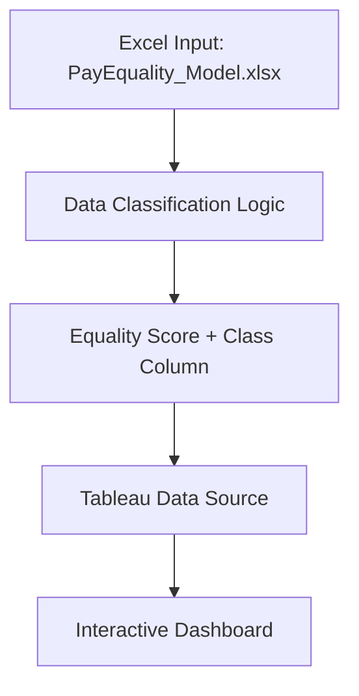

# Deloitte Australia Data Analytics Simulation (Forage)

## 📌 Overview
Simulate an end‑to‑end Deloitte Australia data analytics engagement to assess pay‑equality across four manufacturing sites. Deliverables include an interactive Tableau dashboard and an Excel model that classifies compensation records into Fair, Unfair, and Highly Discriminative categories.

## 🛠 Tech Stack
- **Tableau Desktop** – Dashboard authoring  
- **Microsoft Excel** – Data modeling & classification logic  
- **Git & GitHub** – Version control & hosting  
- **Markdown** – Documentation  

## 🔧 Architecture Diagram

## 🧠 Project Workflow

1. **Data Collection**  
   The dataset contains time-series data from 14 parking lots, recorded over 73 days and 18 intervals per day (every 30 minutes from 8:00 AM to 4:30 PM).

2. **Feature Engineering**  
   - Combine date and time into a single timestamp  
   - Calculate occupancy rate  
   - Encode traffic congestion as numeric levels  
   - Normalize queue length and special day indicators  

3. **Modeling**
   - **Model 1: Baseline Linear Model**  
     Price increases linearly with occupancy rate  
     `Price[t+1] = Price[t] + α * (Occupancy / Capacity)`

   - **Model 2: Demand-Based Pricing**  
     A composite demand function considers occupancy, traffic, queue, special days, and vehicle type.  
     Adjusted price = `BasePrice * (1 + λ * NormalizedDemand)`

   - **Model 3: Competitive Pricing (Optional)**  
     Takes into account prices of nearby lots (via latitude and longitude)  
     Includes rerouting suggestions for full lots or strategic price reduction

4. **Real-Time Simulation with Pathway**  
   - Simulates streaming data with timestamps  
   - Integrates pricing logic into Pathway’s real-time processing pipeline

5. **Visualization with Bokeh**  
   - Real-time line plots of price per parking lot  
   - Competitor price comparisons  
   - Interactive filtering by time, lot, and vehicle type

## 📂 Repository Structure

```
📦 dynamic-parking-pricing/
├── Capstone_Project_Submission.ipynb
├── dataset.csv
├── README.md
├── architecture.md / architecture.png
├── pricing_models.py
├── report.pdf (optional)
├── images/
│   ├── Occupancy_Example.png
│   ├── Price_Over_Time.png
│   ├── Screenshot_Pathway_Star.png
│   └── Screenshot_LLM_App_Star.png

```

## 📈 Output Examples

### 🔹 Sample Output from Capstone_Project_Submission.ipynb

- **Occupancy Rate + Price Calculation Preview**  
  

- **Predicted Prices Over Time**  
  


### 🖼️ Starred Repository Proofs

#### ⭐ Starred Pathway Repository  


#### ⭐ Starred LLM App Repository  


## 🔗 Useful Resources
- [📘 Pathway Documentation](https://pathway.com/developers)
- [📗 Bokeh Docs](https://docs.bokeh.org/en/latest/)
- [📘 Summer Analytics 2025](https://www.caciitg.com/sa/course25/)
