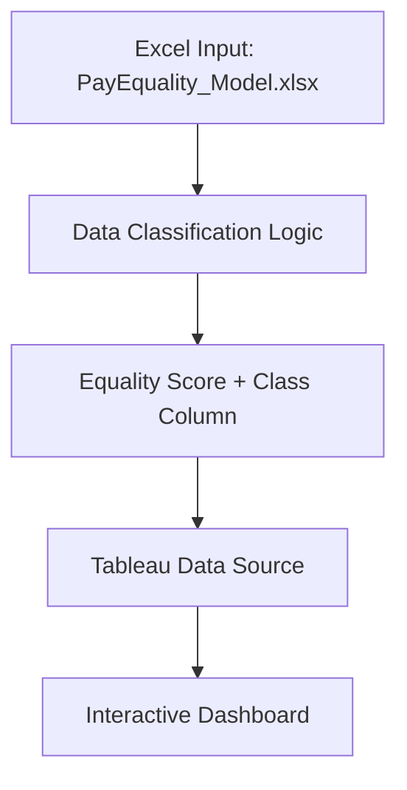

# 📊 Deloitte Australia Data Analytics Simulation (Forage)

## 📌 Overview
This project replicates a real-world Deloitte Australia data analytics engagement focused on assessing pay equality across four manufacturing factories. It includes an interactive Tableau dashboard and an Excel-based classification model that tags employee compensation records as Fair, Unfair, or Highly Discriminative based on their calculated Equality Score.

## 🛠 Tech Stack
- **Tableau**: Interactive dashboard creation  
- **Microsoft Excel**: Data transformation and logic modeling  
- **Git & GitHub**: Version control and hosting  
- **Markdown**: Project documentation

## 🔧 Architecture Diagram


## 🧠 Project Workflow

1. **Data Preparation**  
   - Imported raw salary data into Excel.  
   - Calculated an "Equality Score" ranging from –100 to +100 using role-based statistical indicators.

2. **Classification Logic**  
   - Created a formula to assign labels:  
     - **Fair**: –10 ≤ Score ≤ +10  
     - **Unfair**: –20 < Score < –10 or +10 < Score < +20  
     - **Highly Discriminative**: ≤ –20 or ≥ +20  

3. **Dashboard Development**  
   - Connected Excel model to Tableau.  
   - Built bar charts for factory-wise and device-wise downtime.  
   - Enabled drill-down with interactive filtering.

4. **Insights & Recommendations**  
   - Identified the highest risk factory in terms of pay inequality.  
   - Suggested role-specific corrective actions to improve fairness.

## 📂 Repository Structure


```
Deloitte-Data-Analytics-Simulation/
├── README.md
├── excel/
│   └── PayEquality_Model.xlsx
├── dashboard/
│   ├── Daikibo_Dashboard.png
│   └── TableauWorkbook.twbx    ← Packaged workbook (optional)
└── docs/
    └── project‑brief.pdf


```

## 📈 Output Examples

- **Dashboard Snapshot**  
  

- **Excel Classification Preview**  
  

## 🔗 Useful Resources
- [Forage Deloitte Australia Program](https://www.theforage.com/virtual-internships/prototype/deloitte-data-analytics-au)  
- [Tableau Documentation](https://help.tableau.com/current/guides/e-learning/en-us/tableau-overview.html)  
- [Excel Classification Techniques](https://support.microsoft.com/en-us/excel)

## 👤 Author
Poleboina Deekshith  
- 📧 [deekshithpoleboina@gmail.com](mailto:deekshithpoleboina@gmail.com)  
- 🔗 [LinkedIn](https://linkedin.com/in/deekshithpoleboina)  
- 🐙 [GitHub](https://github.com/Deekshithpoleboina)


## ✅ To Upload on GitHub:
1. Create a new repo named `Deloitte-Data-Analytics-Simulation`.
2. Structure your folders exactly like in the repo tree above.
3. Place these images in `dashboard/`:
   - `Daikibo_Dashboard.png` ← *(Rename `d14de929-ce54...png` to this)*
   - `Excel_Classification_Preview.png` ← *(Rename `21c7ed82-c26...png` to this)*
4. Push the repo.

Let me know if you want me to generate or edit the Excel file `PayEquality_Model.xlsx` or the Tableau `.twbx` file too.

