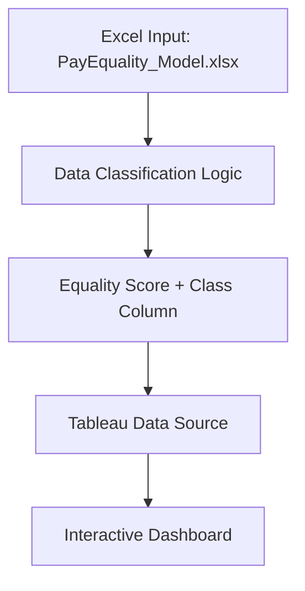

# Deloitte Australia Data Analytics Simulation (Forage)

## 📌 Overview
Simulate an end‑to‑end Deloitte Australia data analytics engagement to assess pay‑equality across four manufacturing sites. Deliverables include an interactive Tableau dashboard and an Excel model that classifies compensation records into Fair, Unfair, and Highly Discriminative categories.

## 🛠 Tech Stack
- **Tableau Desktop** – Dashboard authoring  
- **Microsoft Excel** – Data modeling & classification logic  
- **Git & GitHub** – Version control & hosting  
- **Markdown** – Documentation  

## 🔧 Architecture Diagram

## 🧠 Project Workflow

1. **Data Preparation**
   - Loaded raw compensation dataset into Excel.
   - Computed an “Equality Score” for each role (–100 to +100).

2. **Classification Model**  
   Created a calculated column in Excel:
   - Fair: –10 ≤ Score ≤ +10
   - Unfair: –20 < Score < –10 or +10 < Score < +20
   - Highly Discriminative: Score ≤ –20 or Score ≥ +20

3. **Dashboard Development**
     Connected Excel workbook to Tableau.
     Built two bar charts: 
   - Down Time per Factory (filterable)
   - Down Time per Device Type  
    Configured filter action: selecting a factory drills into device‑level view.

4. **Insights & Recommendations**  
   - Identified the factory with highest pay‑inequality risk.
   - Highlighted top job roles requiring review.

## 📂 Repository Structure

```
Deloitte-Data-Analytics-Simulation/
├── README.md
├── excel/
│   └── PayEquality_Model.xlsx
├── dashboard/
│   ├── Daikibo_Dashboard.png
│   └── TableauWorkbook.twbx    ← Packaged workbook (optional)
└── docs/
    └── project‑brief.pdf


```

## 📈 Output Examples


- **Dashboard Screenshot**  
  

- **Excel Classification Preview**  
  

## 🔗 Useful Resources
- [📘 Pathway Documentation](https://pathway.com/developers)
- [📗 Bokeh Docs](https://docs.bokeh.org/en/latest/)
- [📘 Summer Analytics 2025](https://www.caciitg.com/sa/course25/)
